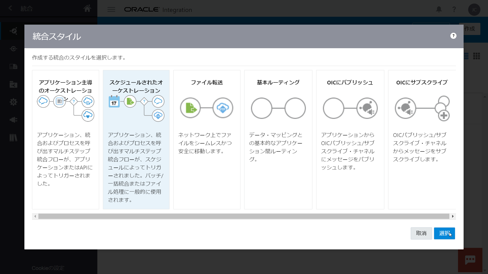
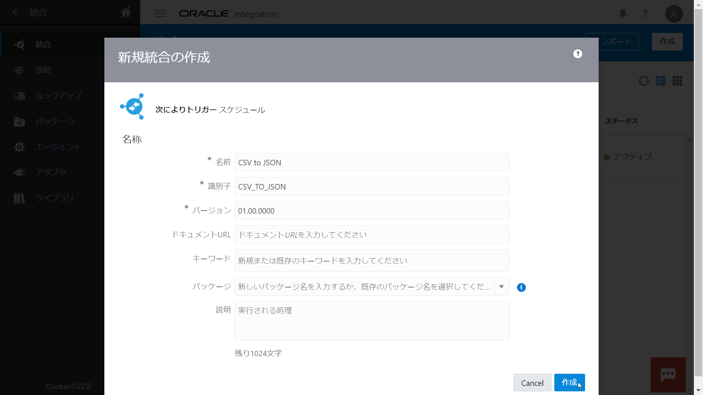

# Oracle Integration Cloud チュートリアル - CSV ファイルから JSON ファイルへの変換

2020年10月

このチュートリアルは、Oracle Integration Cloud の FTP アダプタを使用して、ファイル・サーバーにアップロードされた CSV ファイルを読み取り、JSON ファイルに変換して、再びファイル・サーバーにアップロードする手順を説明します。

## 前提

このチュートリアルでは、Oracle Integration Cloud のインスタンスが作成されており、サービス・コンソールにログインできることを前提としています。
Oracle Integration Cloud のインスタンスをまだ作成していない場合は、次のページを参考に作成してください。

> **[Oracle Integration Cloud インスタンスの作成](https://community.oracle.com/docs/DOC-1037470)**  
> Oracle Integration(OIC) を使い始めるための準備作業として、OIC インスタンスの作成が必要になります。
> この文書は OIC インスタンスの作成方法を ステップ・バイ・ステップで紹介するチュートリアルです

また、Oracle Integration Cloud が提供している SFTP ファイル・サーバーを使用します。
Oracle Integration Cloud のファイル・サーバーは、次のページの手順にしたがって有効化する必要があります。

> **[Oracle Integration Cloud チュートリアル - ファイル・サーバーの有効化](https://github.com/oracle-japan/oic-fileserver/blob/master/README.md)**  
> このチュートリアルは、Oracle Integration Cloud が提供する SFTP に対応したファイル・サーバーを有効化する手順について説明します。

## 接続の作成

Oracle Integration Cloud は、さまざまなアプリケーションやサービスに対応した ***"アダプタ"*** を提供しています。
アダプタは、対応したアプリケーションやサービスに接続する際に必要な固有の手続きをカプセル化します。

***"接続"*** は、アダプタに基づいて作成します。
実際のアプリケーションやサービスにアクセスするために必要なアドレスやポート番号、ユーザー認証などセキュリティの情報を指定します。
これにより、アクセス先のアドレスやパスワードが変更になった場合でも、接続の情報を変更するだけで対応が可能です。

このチュートリアルでは、Oracle Integration Cloud 組み込みの SFTP ファイル・サーバーにアクセスするため、FTP アダプタに基づく接続を作成します。

### ファイル・サーバーの動作環境の確認

FTP アダプタ接続を作成するためには、FTP サーバーのホスト名または IP アドレスとポート番号が必要です。
Oracle Integration Cloud 組み込みの SFTP サーバーの IP アドレスとポート番号は、次の手順で確認できます。

1.  Oracle Integration Cloud のサービス・コンソールにログインします。

    

1.  画面左上のハンバーガ・メニュー・アイコンをクリックします。
    画面左側に表示されるナビゲーション・ペインで、**「設定」** をクリックします。

    

    **「設定」** メニューが表示されます。
    **「File Server」** をクリックします。

    

    **「File Server」** メニューが表示されます。
    **「Settings」** をクリックします。

    

1.  ファイル・サーバーの設定ページが表示されます。
    **「一般」** セクションの **「IPおよびポート情報」** で、ファイル・サーバーが稼働している IP アドレスとポート番号を確認することができます。

    

### FTP アダプタ接続の作成

このチュートリアルでは、FTP アダプタ接続を作成します。

1.  Oracle Integration Cloud のサービス・コンソールにログインします。
    画面左上のハンバーガー・メニュー・アイコンをクリックしてナビゲーション・ペインを開きます。

    ファイル・サーバーの **「設定」** ページを開いている場合は、ナビゲーション・ペインの左上の **「<」** アイコンを2回クリックして、 **「Oracle Integration」** メニューを表示させ、 **「統合」** をクリックします。

    

1.  **「統合」** メニュー の **「接続」** をクリックします。

    

1.  **「接続」** ページが表示されます。
    画面右上にある **「接続」** ボタンをクリックします。

    

1.  **「接続の作成 - アダプタの選択」** ボックスが表示されます。

    

1.  **「検索」** フィールドに `ftp` と入力して、表示を絞り込みます。
    表示された **「FTP」** アイコンをクリックしてから右下の 「選択」 ボタンをクリックします。

    

1.  **「接続の作成」** ボックスが表示されます。
    作成する接続の名前と識別子を入力します（他のフィールドは空欄のままにします）。

    | 入力項目 | 入力する値 |
    |:----|:----|
    | **「名前」** | `OIC SFTP Server` |
    | **「識別子」** | `OIC_SFTP_SERVER` （「名前」を入力すると自動的に設定されます） |
    | **「バージョン」** | `01.00.0000` （初期値をそのまま使用） |

    

1.  接続の詳細を入力するページが表示されます。
    **「接続プロパティ」** セクションでは、次の３つのフィールドに値を入力します。

    | 入力項目 | 入力する値 |
    |:----|:----|
    | **「FTPサーバー・ホスト・アドレス」** | Oracle Integration Cloud 埋め込みファイル・サーバーの IP アドレスを入力 |
    | **「FTPサーバー・ポート」** | Oracle Integration Cloud 埋め込みファイル・サーバーのポート番号を入力 |
    | **「SFTP接続」** | **「はい」** を選択 |

    

1.  **「セキュリティ」** セクションでは、**「セキュリティ・ポリシー」** で **「FTPサーバー・アクセス・ポリシー」** を選択します。
    次に、ファイル・サーバーにアクセスするユーザーのユーザー名とパスワードを入力します。

    

1.  アクセスできることを確認するために、ページの右上にある **「テスト」** ボタンをクリックします。

    

1.  **「接続をテストしますか。」** というボックスが表示されたら、 **「テスト」** ボタンをクリックします。

    

1.  **「接続 <接続名> が正常にテストされました。」** というメッセージが表示されることを確認します。

    

1.  **「保存」** ボタンをクリックします。

    

1.  保存できたら、ページの左上に表示されている **「<」** （戻る）アイコンをクリックして、 **「接続」** ページに戻ります。

    

    作成した接続のステータスが **「構成済」** になっていることを確認します。

## 統合の作成

Oracle Integration Cloud の ***"統合"*** は、アプリケーションやサービスの間の連携のステップを定義したものです。
このチュートリアルで作成する統合は、次の処理を実行します。

1. Oracle Integration Cloud のファイル・サーバーから CSV ファイルを取得し読み取る
1. 読み取ったファイルを、事前定義された形式の JSON ファイルに変換
1. 変換された JSON ファイルを Oracle Integration Cloud のファイル・サーバーに書き出す

これを実装する統合は、次の手順で作成します。

1. 新規の統合を作成
1. FTP アダプタ接続を使用して、ファイル・サーバーから CSV ファイルを読取る設定を行う
1. FTP アダプタ接続を使用して、ファイルサーバーに JSON ファイルを書込む設定を行う
1. CSV ファイルと JSON ファイル間のデータのマッピングの設定を行う

### 新規の統合の作成

1.  Oralce Integration Cloud にログインします。
    **「接続」** ページを開いている場合は、ナビゲーション・ペインで **「統合」** をクリックします。

    

    **「ようこそ」** または **「ホーム」** ページを開いている場合は、ナビゲーション・ペインで **「統合」** をクリックして **「統合」** のメニューを開き、 **「統合」** を選択します。

1.  **「統合」** ページが表示されたら、ページの右上にある **「作成」** ボタンをクリックします。

    

1.  **「統合スタイルの選択」** ボックスが表示されます。
    **「スケジュールされたオーケストレーション」** をクリックしてから、ボックスの右下にある **「作成」** ボタンをクリックします。

    

1.  **「新規統合の作成」** ボックスが表示されます。
    次の情報を入力する必要があります。

    | 入力項目 | 入力する値 |
    |:----|:----|
    | **「統合にどのような名前をつけますか。」** | `CSV to JSON` |
    | **「識別子」** | `CSV_TO_JSON` (`CSV to JSON` と名前をつけると自動的に設定される) |
    | **「バージョン」** | `01.00.0000` （初期状態で入力されている値をそのまま使用） |
    | **「この統合はどのパッケージに属しますか。」** | `oic-csv2json` |

    

    入力したら右下の **「作成」** ボタンをクリックします。

1.  統合が作成されると、キャンバス・ビューで表示されます。
    **「レイアウト」** を初期状態の **「垂直」** から **「水平」** に変更します。

    

### CSV ファイルの読み取りの設定

1.  キャンバス・ビューの右端に表示されている  アイコンをクリックします。

    

    ロールが呼び出しに設定されている接続のリストが表示されます。
    **「FTP」** をクリックして、作成しておいた FTP アダプタ接続を見つけます。

1.  作成した接続を、キャンバス・ビューの **「スケジュール」** アイコンから **「停止」** アイコン（背景が緑色のアイコン）に向けられた矢印の上にドラッグし、表示された **「＋」** マークの上でドロップします。

    

1.  **「Oracleアダプタ・エンドポイント構成ウィザード」** が表示されます。
    **「基本情報」** では、次のように入力します。

    | 入力項目 | 入力する値 |
    |:----|:----|
    | **「エンドポイントにどのような名前をつけますか。」** | `ReadCSV` |

    

    入力したら、**「Oracleアダプタ・エンドポイント構成ウィザード」** の右上にある **「次 >」** ボタンをクリックします。

1.  **「Oracleアダプタ・エンドポイント構成ウィザード」** の **「操作」** では、FTP エンドポイントに対して実行する操作とパラメータを指定します。

    | 入力項目 | 入力する値 |
    |:----|:----|
    | **「操作の選択」** | **「ファイルの読取り」** を選択 |
    | **「転送モードの選択」** | **「バイナリ」** を選択 |
    | **「入力ディレクトリ」** | `/home/users/<ユーザー名>/csv2json/input` |
    | **「ファイル名」** | `input.csv` |

    

    入力したら、**「Oracleアダプタ・エンドポイント構成ウィザード」** の右上にある **「次 >」** ボタンをクリックします。

1.  **「Oracleアダプタ・エンドポイント構成ウィザード」** の **「スキーマ」** では、読取る CSV ファイルのデータの構造の指定方法を選択します。

    | 入力項目 | 入力する値 |
    |:----|:----|
    | **「ファイルのコンテンツの構造を指定しますか。」** | **「はい」** を選択 |
    | **「次の選択肢の中のどれをファイル・コンテンツの構造の説明に使用しますか。」** | **「サンプル区切りドキュメント(例: CSV)」** を選択 |

    

1.  **「Oracleアダプタ・エンドポイント構成ウィザード」** の **「ファイル・コンテンツ - 定義」** では、CSV ファイルの書式の設定を行います。

    | 入力項目 | 入力する値 |
    |:----|:----|
    | **「レコード名の入力」** | `Wifiスポット` |
    | **「レコードセット名の入力」** | `WifiSpotsBook` |
    | **「フィールドの区切り文字の選択」** | **「Comma (,)」** を選択 |
    | **「文字セット」** | **「MS932」** を選択 |
    | **「囲み文字（オプション）」** | **「"」** を選択 （初期値） |
    | **「Terminated By」** | **「${eol}」** を選択 （初期値） |

    

1.  次に CSV ファイルに含まれるデータの設定を行います。

    [サンプル CSV ファイル](https://raw.githubusercontent.com/oracle-japan/oic-csv2json/master/samples/input-1.csv) をローカルにダウンロードします。
    **「Oracleアダプタ・エンドポイント構成ウィザード」** の **「新規デリミタ付きデータ・ファイルの選択」** の **「ファイルを選択」** ボタンをクックします。
    ファイルを開くダイアログ・ボックスが表示されるので、ダウンロードしたサンプル CSV ファイル (`input-1.csv`) を選択して **「開く」** ボタンをクリックします。

    CSV ファイルの各列のデータの設定がテーブル形式で表示されます。
    **「連結解除」** ボタンをクリックしてテーブルを大きく表示させると便利です。

    

1.  テーブルを右方向にスクロールし、次の２つの列の設定を変更します。

    | 列名 | 変更内容 |
    |:----|:----|
    | `WIFI_AREA` | **「Mandatory」** を **「Optional」** に変更 |
    | `LAST_UPDATED` | **「String」** を **「Date」** に変更<br/>**「Mandatory」** を **「Optional」** に変更 |

    

    設定の変更が終わったら、再び **「連結解除」** ボタンをクリックしてテーブルを元の状態に戻し、**「Oracleアダプタ・エンドポイント構成ウィザード」** の **「次 >」** ボタンをクリックします。

1.  **「Oracleアダプタ・エンドポイント構成ウィザード」** の **「サマリー」** が表示されるので、 **「完了」** ボタンをクリックします。

    

1.  キャンバス・ビューに **「マップ先 ReadCSV」** と **「ReadCSV」** の2つが追加されています。

    * **「マップ先 ReadCSV」** は、FTP アダプタ接続を呼び出す時のパラメータ（読取るファイル名やディレクトリ名など）を指定する場合に使用するマッピングです。
      このチュートリアルでは、このマッピングは使用しません。
    * **「ReadCSV」** は、FTP アダプタ接続によるファイルの読取りの設定です。

    

    画面の右上にある **「保存」** ボタンをクリックして、ここまでの設定を保存します。

### JSON ファイルの書き込みの設定

1.  キャンバス・ビューの右端に表示されている  アイコンをクリックします。
    **「FTP」** をクリックして、作成しておいた FTP アダプタ接続を見つけます。

1.  作成した接続を、キャンバス・ビューの **「ReadCSV」** アイコンから **「停止」** アイコン（背景が緑色のアイコン）に向けられた矢印の上にドラッグし、表示された **「＋」** マークの上でドロップします。

    

1.  **「Oracleアダプタ・エンドポイント構成ウィザード」** が表示されます。
    **「基本情報」** では、次のように入力します。

    | 入力項目 | 入力する値 |
    |:----|:----|
    | **「エンドポイントにどのような名前をつけますか。」** | `WriteJSON` |

    

    入力したら、**「Oracleアダプタ・エンドポイント構成ウィザード」** の右上にある **「次 >」** ボタンをクリックします。

1.  **「Oracleアダプタ・エンドポイント構成ウィザード」** の **「操作」** では、FTP エンドポイントに対して実行する操作とパラメータを指定します。

    | 入力項目 | 入力する値 |
    |:----|:----|
    | **「操作の選択」** | **「ファイルの書き込み」** を選択 |
    | **「転送モードの選択」** | **「バイナリ」** を選択 |
    | **「入力ディレクトリ」** | `/home/users/<ユーザー名>/csv2json/output` |
    | **「ファイル名」** | `output-%SEQ%.json` |

    

    入力したら、**「Oracleアダプタ・エンドポイント構成ウィザード」** の右上にある **「次 >」** ボタンをクリックします。

1.  **「Oracleアダプタ・エンドポイント構成ウィザード」** の **「スキーマ」** では、書込む JSON ファイルのデータの構造の指定方法を選択します。

    | 入力項目 | 入力する値 |
    |:----|:----|
    | **「ファイルのコンテンツの構造を指定しますか。」** | **「はい」** を選択 |
    | **「次の選択肢の中のどれをファイル・コンテンツの構造の説明に使用しますか。」** | **「サンプルJSONドキュメント」** を選択 |

    

1.  **「Oracleアダプタ・エンドポイント構成ウィザード」** の **「ファイル・コンテンツ - 定義」** では、書込む JSON ファイルのサンプルをアップロードします。

    [サンプル JSON ファイル](https://raw.githubusercontent.com/oracle-japan/oic-csv2json/master/samples/output-1.json) をローカルにダウンロードします。
    次に、**「ファイルを選択」** ボタンをクリックして、ダウンロードしたサンプル JSON ファイルを選択します。

    

    **「次 >」** ボタンをクリックします。

1.  **「Oracleアダプタ・エンドポイント構成ウィザード」** の **「サマリー」** が表示されたら、**「完了」** ボタンをクリックします。

    

1.  キャンバス・ビューに **「マップ先 WriteJSON」** と **「WriteJSON」** の2つが追加されています。

    * **「マップ先 WriteJSON」** は、 **「ReadCSV」** によって読込んだ CSV ファイルのデータを、JSON 形式に変換するための、データのマッピングを設定します。
    * **「WriteJSON」** は、FTP アダプタ接続によるファイルの書込みの設定です。

    

    画面の右上にある **「保存」** ボタンをクリックして、ここまでの設定を保存します。

### CSV ファイルから JSON ファイルへのデータのマッピングの設定

読取った CSV ファイルのデータを JSON ファイルに変換する際の、データのマッピングの設定を行います。

1.  キャンバス・ビューで、 **「マップ先 WriteJSON」** を選択します。
    表示される 「編集」 アイコンをクリックします。

    

1.  データのマッピングの設定を行うためのマッパーが表示されます。
    マッパーの画面左側に表示されている **「Sources」** ペインの **「ReadCSV Response (FTP)」** → **「SyncReadResponse」** → **「FireReadResponse」** → **「WifiSpotsBook」** → **「Wifiスポット」** を、画面右側に表示されている **「Target」** ペインの **「WriteJSON Request (FTP)」** → **「request-wrapper」** → **「freeWifiSpots」** にドラッグ＆ドロップします。

    

1.  次のデータ項目をドラッグ＆ドロップでマップします。

    | Source | Target |
    |:----|:----|
    | CITY_CODE | cityCode |
    | WIFI_NO | no |
    | WIFI_NAME | name |
    | WIFI_NAME_KANA | kana |
    | WIFI_ADDRESSS | address |
    | SSID | ssid |
    | WIFI_AREA | area |
    | WIFI_URL | url |
    | LAST_UPDATED | lastUpdated |

    マッパーは次のような表示になります。

    

1.  画面右上の **「検証」** ボタンをクリックします。

    

1.  **「マッピングは有効で、使用する準備ができています。」** というメッセージが表示されたら、 **「閉じる」** ボタンをクリックします。

    

### トラッキングの設定

Oracle Integration Cloud では、作成した統合の実行状況をトラッキングするための設定を行う必要があります。
トラッキングの設定は次の手順で行います。

1.  統合キャンバスの右上にある （アクション）アイコンをクリックします。
    表示されたメニューから **「トラッキング」** を選択します。

    

1.  **「トラッキング用のビジネス識別子」** ボックスが表示されます。
    ボックス左側のツリーから **「schedule」** の下の **「startTime」** を、ボックスの右側に表示されているテーブルの **「トラッキング・フィールド」** 列の1行目にドラッグ＆ドロップします。

    

1.  **「トラッキング用のビジネス識別子」** ボックスの右下にある **「保存」** ボタンをクリックしてボックスを閉じます。

    

1.  ページの右上にある **「保存」** ボタンをクリックしてから **「閉じる」** ボタンをクリックします。
    **「統合」** の一覧が表示されるページに戻ります。

    

## 作成した統合の動作確認

作成した統合を実行してみましょう。

1.  Oracle Integration Cloud のファイル・サーバーに CSV ファイルをアップロードします。

    ```sh
    sftp -P <ポート番号> <ユーザー名>@<IPアドレス>
    ```

    ```sh
    mkdir csv2json
    cd csv2json
    mkdir input
    cd input
    put <パス>/input-1.csv ./input.csv
    ```

1.  Oracle Integration Cloud で作成した統合を実行するには、アクティブ化します。
    実行する統合にマウス・ポインタを合わせ、表示された **「アクティブ化」** アイコンをクリックします。

    

1.  **「統合のアクティブ化」** ボックスが表示されます。
    ボックスの右下に表示されている **「アクティブ化」** ボタンをクリックします。

    

1.  **「アクティブ状態のリフレッシュ」** アイコンをクリックして、統合のステータスが **「アクティブ」** に変更されていることを確認します。

    

1.  実行する統合にマウスポインタを合わせ、表示された **「実行」** アイコンをクリックします。

    

1.  ポップアップの下に表示されている **「すぐに送信」** リンクをクリックします。

    

1.  **「すぐに送信」** ボックスが表示されます。
    **「すぐに送信」** ボタンをクリックします。

    

1.  実行結果を確認してみましょう。
    実行結果は、トラッキングの機能を使用して確認できます。
    ナビゲーション・ペインの左上にある **「<」** アイコンをクリックします。

    ナビゲーション・ペインに **「Oracle Integration」** のメニューが表示されたら、 **「モニタリング」** を選択します。

    

    **「モニタリング」** のメニューが表示されたら、 **「統合」** をクリックします。

    

    **「統合」** のメニューが表示されたら、 **「トラッキング」** をクリックします。

    

1.  **「インスタンスのトラッキング」** ページが表示されます。

    リストに何も表示されない、またはインスタンスが実行の場合は、
    
    をクリックして最新の状態に更新してください。

    ステータスが **「成功」** と表示されていることを確認します。
    インスタンスにマウス・ポインタを合わせると右側に表示される **「詳細の表示」** アイコンをクリックします。

1.  ページの右上にある  （アクション）アイコンをクリックし、表示されたメニューから **「アクティビティ・ストリーム」** を選択します。

    

1.  アクティビティ・ストリームが表示され、処理の流れが確認できます。

    

1.  SFTP サーバーにログインして、`/home/users/<ユーザー名>/csv2json/output/output-1.json` をダウンロードして、生成されたファイルを確認します。

----
お疲れ様でした。
以上でこのチュートリアルは終了です。
